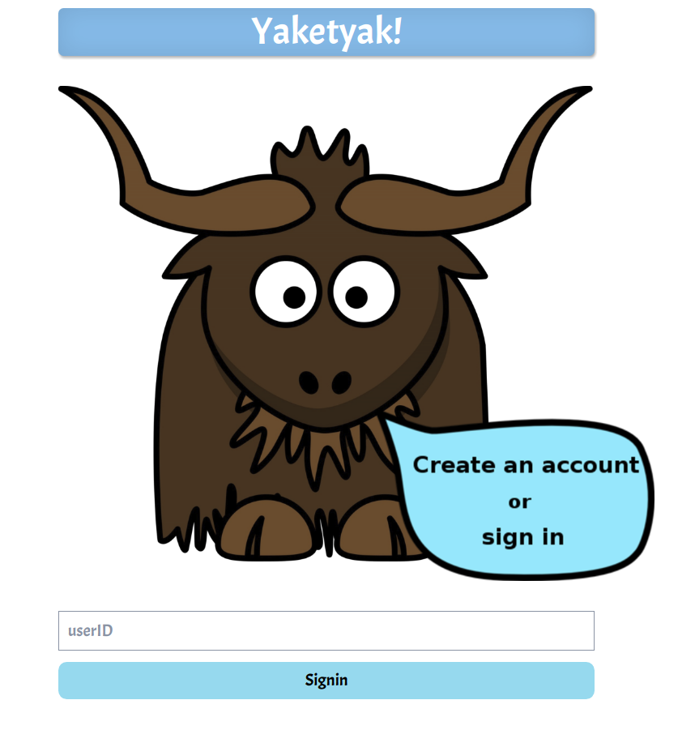
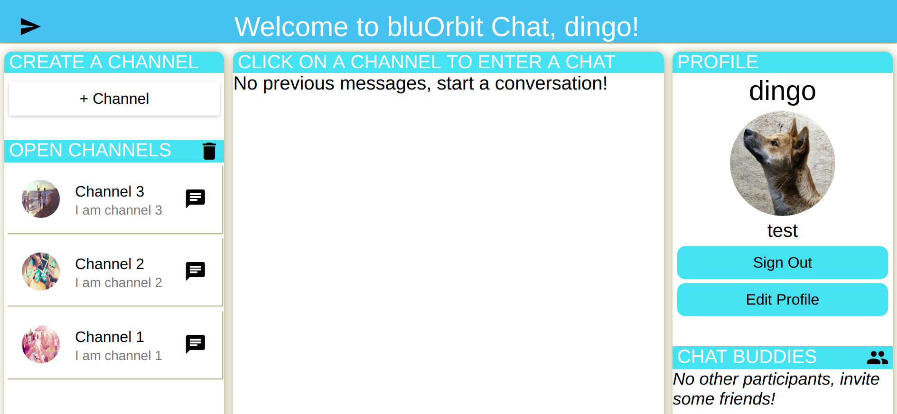

# Send Bird Chat Application


Front-End application utilizing the SendBird API to implement a live chat room.


[SendBird Site](https://sendbird.com/ "SendBird API")

## DATA PERSISTENCE
- Redux
  - user
  - open channels
  - channel participant list
  - messages
  - tracking events
    - all events are tracked and stored in app store

## HOSTING
- in development stage

## DEPLOYMENT
- in development stage

## CODE REPOSITORY
- GitHub  `you are here`

## TOOLS
- React
- Redux
- SendBird
- Material UI
- Material.io icons
- React-tracking
- Superagent
- Babel
- Webpack
- Sass

## GETTING STARTED

### Setup
- Clone this repo from your terminal

  `git clone https://github.com/sdmccoy/sbchat.git`

- Install the dependencies via npm || yarn

  `npm install`

- Create a .env file in the root directory

  `touch .env`

- Include the following in your .env file
  - Create your own APP ID & API TOKEN from [SendBird Signin Dashboard](https://dashboard.sendbird.com/auth/signin "SendBird Signin")

    ```javascript
    APP_ID='your-secret-app-id'
    ```

    ```javascript
    API_TOKEN='your-secret-api-token'
    ```

  - Include this for the platform API call

    ```javascript
    API_CONNECT_URL='https://api.sendbird.com/v3/open_channels/'
    ```
  - Switch this to 'production' when ready for a deployed site

    ```javascript
    NODE_ENV='dev'
    ```

## Launch Development

- In your terminal in the root directory of the project run

  `npm run watch`

- Open up a Chrome browser and type into the address bar

  http://localhost:8080/

- Your app should now be launched

## APPLICATION USE

### Sign In

- Type in a userId
  - SendBird checks their own database for duplicate users
  - Currently there is no user/password authentication
    - Yes, you can easily sign in as another user (for now)


  - 

### Main Landing Page
- Application will redirect to the /main route and load the chat componenents

- 

- On load, the page will display
  - Dynamic welcome bar with nickname || userId (if no nickname)
  - CREATE A CHANNEL component
  - Any current OPEN CHANNELS from a query to sendbird database
  - CHAT message board with dynamic title if you're in/not in a chat
  - PROFILE component with current user information.
  - PARTICIPANT LIST component with no participants until you enter a channel

### Create a Channel Component

- Button to show the create a channel form
  - 


- When clicked, the form enters from the left side. Options to create a new channel, or cancel the form
  - 

### Open Channels Component

- If there are no open channels
  - 


- If there are open channels. Click on one to enter.
  - 


- Click on trash icon to open delete options. Click on button to delete a channel.
  - 

### Profile Component

- Profile component with (in top down order)
  - nickname (if available)
  - avatar (random photo from sendbird if link is not provided)
  - userId
  - signout button
  - edit profile (opens edit form)
  - 


- When edit button is clicked, the form enters from the right side. Options to create a nickname, load an avatar from a url, or cancel the form
  - 


### Participant List Component

- If you are not in a channel
  - 


- If you are in a channel, participants will be listed
  - 


### Chat Component

- If you are not in a channel
  - 


- If you are in a channel, previous messages will are loaded/listed. Title is context dynamic.
  - 


- Chat submit a message.
  - 


### Message Component

- Message from other users
  - 


- If you own the message, you can delete or edit with the icons.
  - 


- Edit a message.
  - 

## TODO's

- Tests
  - Components are tracked when mounted. But front end tests need to be implemented with Jest.
- CSS/Sass
  - Currently set for desktop view with 768 height. Need to create a responsive design.
- Remove Handlers
  - Remove handler needs to go after the action occurs. Currently when implement it restricts the handler from firing. Need to fix this bug.
- Participant listed
  - Need a handler for participants on enter. Not just a get request.
